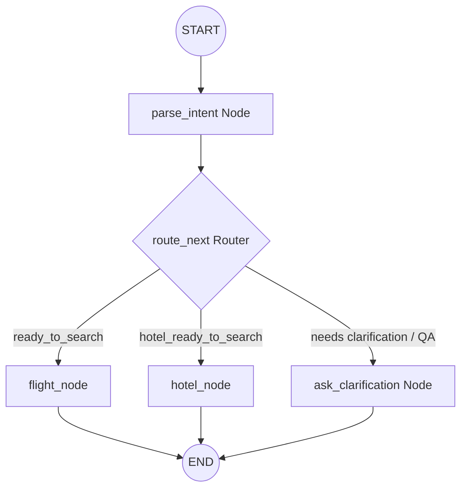
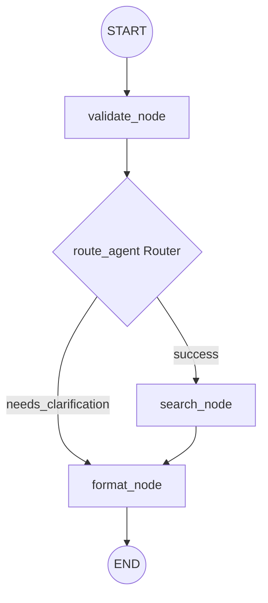

# ✈️ AI Travel Companion Chatbot (Sara)

This project is a state-of-the-art **AI Travel Chatbot** named **Sara** that assists users in searching and booking flights, reserving hotels, and planning customized day-by-day luxury travel itineraries. 

It is designed with a decoupled architecture utilizing a **FastAPI + LangGraph** backend and a **React + Vite + Tailwind CSS** frontend.

---

## 🚀 Key Features

*   **Stateful Booking Flows**: Seamlessly guides users through the checklist-driven booking process for both flights and hotels using LangGraph state machines.
*   **Live Search Integrations**:
    *   **Flights**: Fetches real-time flight options, prices, classes, and schedules via the SerpAPI Google Flights engine.
    *   **Hotels**: Fetches real-time accommodation details, prices per night, guest ratings, and pictures via the SerpAPI Google Hotels engine.
*   **SerpAPI Disk Caching**: Hashes and caches incoming query parameters (with key normalization, filtering out session IDs/API keys/timestamps) to a local cache under `.cache/serpapi/` with a default Time-To-Live (TTL) of 1 hour. This avoids duplicate queries, cuts response times, and saves API quota.
*   **Dynamic Suggestion Cards**: Instantly intercepts accommodation suggestion requests (e.g., *"suggest hostels in Goa"*) and launches a card search with next-week stay defaults on screen.
*   **Booking Changes & Details Cloning**: Detects attempts to select a new hotel when the user already has a confirmed booking, prompting them to cancel the old one and automatically copying over previous parameters (dates, guests, name, contact) to bypass repetitive entry.
*   **Heuristic Option Filtering**: Filters active flight or hotel options to show only the single target card in response to user questions (e.g. *"which is the cheapest flight?"* or *"show the IndiGo flight"*).
*   **Automated Email Vouchers**: Integrates Brevo SMTP mailers to dispatch transactional booking confirmations directly to the passenger's inbox upon payment completion.
*   **Tailored Luxury Itineraries**: Compiles detailed day-by-day tourist plans with breakfast, morning/afternoon/evening events, transport, packing tips, and emergency guides.
*   **Ticket Generation**: Once booking is confirmed, it generates realistic digital boarding passes (flights) and booking vouchers (hotels) featuring PNR codes, seat numbers, gate information, and barcodes, with option to save them locally.
*   **Conversational Guardrails & Safety**:
    *   **Interruption Handling**: Answers travel questions in the middle of a booking, and gently redirects back to the current booking step.
    *   **Off-Topic Filter**: Hard-refuses completely unrelated queries (e.g. general food recipes, coding, math) to keep the chat context focused on travel.
    *   **Input / Relative Date Validation**: Automatically rejects past travel dates and invalid email formats, returning custom verification prompts. Resolves relative checkout inputs (e.g., *"tomorrow"*, *"3 nights"*, *"1 week"*) dynamically against the check-in date.
    *   **Accurate Price & Currency Cleansing**: Parses and calculates total prices containing decimal cents and currency codes (e.g., `₹2,916.00`) accurately across multiple rooms or nights.

---

## 🛠️ Technology Stack

### Backend
*   **Python 3.10+**
*   **FastAPI**: Asynchronous web server hosting the REST endpoints.
*   **LangGraph**: Orchestrates the multi-turn session state machines.
*   **LangChain Groq**: Provides NLU and parsing via `llama-3.1-8b-instant` and `llama-3.3-70b-versatile`.
*   **Pydantic**: Structural model validation schemas.
*   **SerpAPI**: Google Flights & Google Hotels engines for live data.
*   **Pickle**: Local session file caching (`sessions.pkl`).
*   **Pytest**: Unit and integration test suite.

### Frontend
*   **React (v18)**: Component-based user interface.
*   **Vite**: Rapid asset compilation and hot-reloading dev server.
*   **Tailwind CSS**: Utility-first CSS layout styling.
*   **Axios**: HTTP communication client.
*   **Lucide React**: Vector icon assets.
*   **Html2canvas**: Renders and downloads digital tickets.

---

## 📂 Codebase Directory Layout

```
travel-chatbot/
├── frontend/
│   └── react-app/
│       ├── src/
│       │   ├── components/       # UI components (ChatInterface, Ticket, Cards, Bubbles)
│       │   ├── utils/            # Frontend helper utilities
│       │   ├── main.jsx          # React app mounter
│       │   ├── App.jsx           # Main page structure mounter
│       │   └── index.css         # Main stylesheet with Tailwind directives
│       ├── tailwind.config.js    # Design system configurations
│       └── package.json          # Node dependencies
├── src/
│   ├── app/
│   │   ├── agents/
│   │   │   ├── flight_agent.py   # Flight Agent LangGraph StateGraph (validate, search, format nodes)
│   │   │   └── hotel_agent.py    # Hotel Agent LangGraph StateGraph (validate, search, format nodes)
│   │   ├── api/
│   │   │   └── routes.py         # /api/chat FastAPI endpoint and session cache loader
│   │   ├── db/
│   │   │   ├── checkpointer.py   # SQLite StateGraph checkpointer config
│   │   │   └── database.py       # Pydantic base settings DB setup
│   │   ├── orchestrator/
│   │   │   ├── graph.py          # Orchestrator StateGraph definitions and interruption handlers
│   │   │   ├── nlu_parser.py     # Groq LLM parsing, entity extractions, date validations
│   │   │   ├── flight_flow.py    # Flight sequence logic and ticket compiler
│   │   │   ├── hotel_flow.py     # Hotel sequence logic and summary invoice compiler
│   │   │   └── itinerary_flow.py # Luxury day-by-day planner prompt instructions
│   │   ├── schemas/
│   │   │   ├── chat.py           # Pydantic JSON request/response models
│   │   │   └── state.py          # State schemas (FlightState, HotelState, CommonState, ConversationState)
│   │   ├── services/
│   │   │   └── email_service.py  # Dispatches transactional booking confirmations (Brevo)
│   │   ├── utils/
│   │   │   ├── cache.py          # SerpAPI caching engine (TTL/parameter normalization)
│   │   │   └── mock_data.py      # Fallback database listings
│   │   └── main.py               # Main entrance server script
│   └── tests/
│       ├── test_cache.py         # Unit tests for TTL and cache key normalization
│       ├── test_chat.py          # Integration test suite for chat flows
│       └── test_hotel_fixes.py   # Unit tests for relative checkout and price parsing
├── .env.example                  # Template configuration environment
├── requirements.txt              # Backend packages
└── README.md                     # Documentation
```

---

## 🛡️ Multi-Agent Architecture & A2A Protocol

This system is built as a **multi-agent application** utilizing the **Agent-to-Agent (A2A) protocol** for inter-agent messaging:
- **Orchestrator Agent (Friendly Assistant)**: The user-facing conversational entry point. It handles natural language parsing, state retention, interruptions, and routes step flows.
- **Flight & Hotel Sub-Agents**: Specialised domain agents. They do not interact with the user; they receive structured A2A `TaskRequest` messages and return standard A2A `TaskResponse` messages.

### 🎨 Design Decisions

1. **State Partitioning (`state.py`)**:
   Instead of a monolithic state dict, variables are cleanly isolated into:
   - `FlightState`: Handles variables relevant only to flight selections (origin, destination, passenger names, ticket PNR).
   - `HotelState`: Handles hotel selections (city, check-in, check-out, selected hotel).
   - `CommonState`: Contains common dialogue variables (messages history, active step, NLU extracted intent, interruption status).
   
   The main `ConversationState` inherits all three schemas using multiple inheritance (`class ConversationState(CommonState, FlightState, HotelState)`), keeping the orchestrator robust yet modular.

2. **LangGraph Sub-Agents**:
   Both `flight_agent` and `hotel_agent` are modeled as independent **LangGraph `StateGraph` workflows**, ensuring strict adherence to the assignment deliverables. Each sub-agent features:
   - **Input Validation Node (`validate_node`)**: Checks for complete inputs and sets `needs_clarification` status if values are missing.
   - **Search Node (`search_node`)**: Calls the live search provider (SerpAPI with local disk cache) or falls back to local mock data.
   - **Formatting Node (`format_node`)**: Passes structured results back to the caller.

---

## 📊 Graph Visualisations

Here are the Mermaid flowcharts of the active LangGraph workflows in the chatbot:

### 1. Orchestrator Graph


### 2. Flight / Hotel Sub-Agent Graph
*(Both sub-agents follow this independent graph pipeline)*


---

## ⚙️ Setup & Installation

### Prerequisites
*   Python 3.10+
*   Node.js (v18+) & npm

### 1. Backend Setup
1.  Navigate to the project root:
    ```bash
    cd travel-chatbot
    ```
2.  Create and activate a virtual environment:
    ```bash
    python -m venv .venv
    # On Windows:
    .venv\Scripts\activate
    # On macOS/Linux:
    source .venv/bin/activate
    ```
3.  Install dependencies:
    ```bash
    pip install -r requirements.txt
    ```
4.  Configure Environment Variables:
    *   Create a `.env` file in the root directory by copying the sample:
        ```bash
        cp .env.example .env
        ```
    *   Open `.env` and fill in your keys:
        ```env
        GROQ_API_KEY=your_groq_api_key
        SERPAPI_API_KEY=your_serpapi_api_key
        ```
5.  Start the FastAPI Server:
    ```bash
    python src/app/main.py
    ```
    The server will start running at `http://localhost:8000`.

---

### 2. Frontend Setup
1.  Navigate to the React application folder:
    ```bash
    cd frontend/react-app
    ```
2.  Install packages:
    ```bash
    npm install
    ```
3.  Run the Development Server:
    ```bash
    npm run dev
    ```
    Open your browser and navigate to the local address displayed (typically `http://localhost:5173`).

---

### 3. Running the Test Suite
The repository includes unit and integration tests (using `pytest`) to verify agent logic, caching functionality, and date/price parsing.
1.  Activate your virtual environment.
2.  From the `travel-chatbot` root directory, run:
    ```bash
    python -m pytest
    ```

---

## 🔒 Guardrails and Validation Details

1.  **Date Constraint Checks**: Checks whether departure or check-in dates are in the past. Invalidates and requests correction.
2.  **Schema Consistency**: Uses Pydantic to ensure all inputs match type limits, avoiding system crashes from malformed payloads.
3.  **Out-of-Scope Shield**: Categorizes questions. Casual chats get friendly answers, travel queries are answered concisely, and non-travel prompts (e.g. code/math) are blocked.
4.  **Data Fallbacks**: Keeps hotel reservations active by retrieving local data if external APIs exceed standard timeout limits.
5.  **SerpAPI Rate Limiting**: The file-caching layer caches external API responses to avoid hitting request rate limits or consuming excessive quota.
